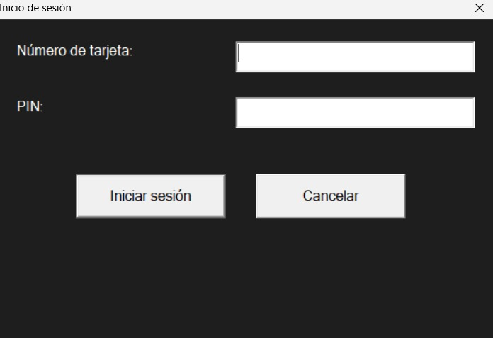

# Documentación del Proyecto: Cajero Automático GUI

Este documento describe los pilares de la Programación Orientada a Objetos (POO) implementados, el uso de punteros, y otros aspectos relevantes del desarrollo del cajero automático con interfaz gráfica.

---
## PARA EJECUTAR EL PROYECTO USTED PUEDE:

### Clonar el proyecto:
```bash
git clone https://github.com/EDERANDER/Cajero-Automatico-Cplusplus-Win32GUI-DialogBased.git
```

### Descargar el ejecutable:
**Ejecutable.exe**

### Descargar el repositorio directamente aquí:
Ejecutarlo en su **Codeblocks**.

# Información de Usuarios y Clientes VIP

A continuación se muestra la información de los usuarios y clientes VIP:

| **Nombre**          | **Número de Tarjeta** | **Contraseña** |
|---------------------|-----------------------|----------------|
| **Juan Perez**      | 1234567890            | 1234           |
| **Maria Lopez**     | 0987654321            | 5678           |
| **Carlos Sanchez**  | 1122334455            | 4321           |
| **Ana Montes**      | 2233445566            | 5678           |
| **Luis Ramirez**    | 3344556677            | 8765           |
| **Marta Diaz**      | 4455667788            | 1234           |
| **Pedro Fernandez** | 5566778899            | 6789           |



# Enlaces a mis perfiles

- [Visita mi perfil de LinkedIn](https://www.linkedin.com/in/eder-ander-bravo-531377271/)
- [Visita mi perfil de GitHub](https://github.com/EDERANDER)


## 1. Pilares de la Programación Orientada a Objetos (POO)

### **Abstracción**
Se encapsularon los detalles de la lógica de negocio en las clases `Usuario` y `ClienteVIP`. Esto permite que las funcionalidades del sistema se utilicen sin necesidad de conocer cómo están implementadas internamente. Ejemplo:

```cpp
std::string obtenerInformacion();
```
El método `obtenerInformacion` devuelve una representación textual del usuario sin exponer la lógica de cómo se genera esta información.

### **Encapsulamiento**
Los atributos de las clases, como `nombre`, `numeroTarjeta`, `pin` y `saldo`, son privados o protegidos. Esto asegura que solo los métodos de la clase puedan acceder y modificar estos atributos, preservando la integridad de los datos.

```cpp
bool verificarCredenciales(const std::string& tarjeta, const std::string& pinIngresado);
```
Este método verifica las credenciales sin exponer directamente el atributo `pin`.

### **Herencia**
La clase `ClienteVIP` hereda de la clase base `Usuario`, extendiendo su funcionalidad al agregar una línea de crédito. Esto demuestra el principio de reutilización de código y especialización de clases.

```cpp
class ClienteVIP : public Usuario {
    double lineaCredito;
    ...
};
```

### **Polimorfismo**
El sistema utiliza polimorfismo al sobrescribir el método `retirar` en la clase `ClienteVIP`. Esto permite que el comportamiento del método varíe dependiendo de si el usuario es regular o VIP.

```cpp
bool retirar(double cantidad) override;
```
---

## 2. Uso de Punteros
Los punteros se utilizaron para administrar dinámicamente los objetos de usuario y garantizar la extensibilidad del sistema. Los usuarios están almacenados en un arreglo de punteros:

```cpp
Usuario* usuarios[] = {
    new Usuario("Juan Perez", "1234567890", "1234", 1000.0),
    new ClienteVIP("Maria Lopez", "0987654321", "5678", 5000.0, 2000.0),
    ...
};
```
Al finalizar el programa, se libera la memoria asociada a estos punteros:

```cpp
for (Usuario* usuario : usuarios) {
    delete usuario;
}
```
Esto previene fugas de memoria.

---

## 3. Gestión de la Interfaz Gráfica
Se empleó la API de Windows para crear ventanas de diálogo e interactuar con el usuario. Las funciones principales incluyen:

- `DlgLogin`: Controla la ventana de inicio de sesión.
- `DlgMain`: Maneja las operaciones principales del usuario, como depósito, retiro y transferencia.
- `DlgTransfer`: Permite realizar transferencias entre cuentas.

### **Personalización de Interfaz**
- **Colores**: Se definieron pinceles (`HBRUSH`) para personalizar los colores de fondo y botones.
- **Eventos**: Se gestionaron mensajes como `WM_COMMAND` y `WM_CTLCOLORSTATIC` para manejar la lógica y la estética de los controles.

---

## 4. Funcionalidades Principales

### **Inicio de Sesión**
Se validan las credenciales ingresadas por el usuario comparándolas con los datos almacenados.

### **Depósitos y Retiros**
Se implementaron métodos que actualizan el saldo del usuario y aseguran que no se retiren fondos superiores al saldo disponible (o al crédito en caso de usuarios VIP).

### **Transferencias**
Se utiliza el método `transferir` para mover fondos entre usuarios, garantizando que no se transfiera dinero a la misma cuenta de origen.

---

## 5. Validaciones
El programa incluye validaciones robustas para entradas de usuario:
- Asegurar que las cantidades ingresadas sean válidas y mayores a cero.
- Comprobar que las credenciales sean correctas antes de acceder al sistema.

---

## 6. Detalles Técnicos

### **Clases y Métodos Clave**
#### Clase `Usuario`
```cpp
class Usuario {
protected:
    std::string nombre;
    std::string numeroTarjeta;
    std::string pin;
    double saldo;

public:
    Usuario(const std::string& nombre, const std::string& numeroTarjeta, const std::string& pin, double saldo);
    virtual std::string obtenerInformacion();
    bool verificarCredenciales(const std::string& tarjeta, const std::string& pinIngresado);
    virtual bool retirar(double cantidad);
    void depositar(double cantidad);
    void transferir(Usuario* destinatario, double cantidad);
    virtual ~Usuario();
};
```

#### Clase `ClienteVIP`
```cpp
class ClienteVIP : public Usuario {
private:
    double lineaCredito;

public:
    ClienteVIP(const std::string& nombre, const std::string& numeroTarjeta, const std::string& pin, double saldo, double credito);
    bool retirar(double cantidad) override;
    std::string obtenerInformacion() override;
};
```

### **Mensajes Clave de Windows**
- `WM_COMMAND`: Maneja eventos de interacción con botones.
- `WM_CTLCOLORSTATIC`: Configura los colores de los controles estáticos.

---

## 7. Futuras Mejoras
- **Soporte para múltiples monedas**.
- **Historial de transacciones** para cada usuario.
- **Integración con una base de datos** para persistir la información de usuarios.

---

## 8. Conclusión
El sistema implementado demuestra un sólido entendimiento de los conceptos de POO y la gestión de memoria con punteros, así como el uso eficiente de la API de Windows para la interfaz gráfica. Es un ejemplo funcional y extensible de un cajero automático básico.
